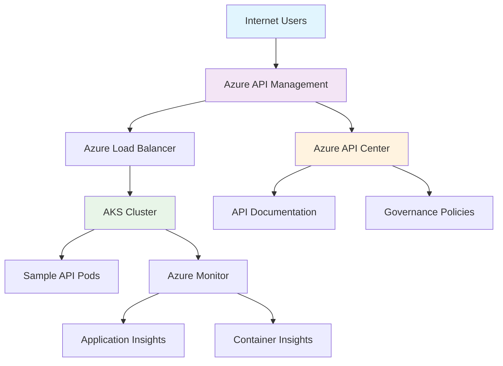

# IPaaS AKS Labs

> **Integration Platform as a Service (IPaaS) with Azure Kubernetes Service Labs**

A comprehensive collection of hands-on workshops and labs for learning API management, integration, and governance using Azure Kubernetes Service (AKS), Azure API Management (APIM), and Azure API Center.


## 🎯 Objectives

This repository provides practical, step-by-step guides to help you:

- **Deploy and manage APIs** on Azure Kubernetes Service
- **Implement API governance** with Azure API Management
- **Centralize API discovery** using Azure API Center
- **Apply enterprise policies** for security, rate limiting, and monitoring
- **Build integration solutions** without complex dependencies
- **Troubleshoot common issues** in cloud-native API management

## 🚀 Getting Started

### Prerequisites

- **Azure Subscription** with Contributor permissions
- **Azure CLI** installed and configured
- **PowerShell** (Windows) or **PowerShell Core** (cross-platform)
- Basic familiarity with **Kubernetes concepts**
- Understanding of **REST API** principles

### Quick Setup

```powershell
# Clone the repository
git clone https://github.com/YOUR_USERNAME/ipaas-aks-labs.git
cd ipaas-aks-labs

# Login to Azure
az login --use-device-code

# Start with the comprehensive guide
# Follow instructions in api-management-with-aks-comprehensive-guide.md
```

## 📚 Workshops & Labs

### 🔧 Core Workshop

**[API Management with AKS - Comprehensive Guide](api-management-with-aks-comprehensive-guide.md)**

A complete end-to-end workshop covering:
- AKS cluster deployment and configuration
- Sample API development and containerization
- Azure API Management setup and policies
- Azure API Center registration and governance
- Monitoring, troubleshooting, and cleanup

**Duration:** 2-3 hours  
**Difficulty:** Beginner to Intermediate

## 🏗️ Architecture Overview



## 🛠️ Technologies Used

| Technology | Purpose | Version |
|------------|---------|---------|
| **Azure Kubernetes Service (AKS)** | Container orchestration platform | Latest |
| **Azure API Management** | API gateway and management | Standard/Developer SKU |
| **Azure API Center** | API governance and discovery | Latest |
| **Azure Container Registry** | Private container registry | Basic SKU |
| **Azure Application Insights** | Application performance monitoring | Latest |
| **Node.js** | Sample API runtime | 18.x |
| **Express.js** | Web framework for sample API | 4.x |

## 📋 Workshop Structure

Each workshop follows a consistent structure inspired by [Azure Samples AKS Labs](https://azure-samples.github.io/aks-labs/):

1. **🎯 Objectives** - Clear learning goals
2. **📋 Prerequisites** - Required tools and knowledge
3. **🔧 Setup** - Environment preparation
4. **👨‍💻 Hands-on Labs** - Step-by-step instructions
5. **🔍 Troubleshooting** - Common issues and solutions
6. **📊 Monitoring** - Observability and analytics
7. **🧹 Cleanup** - Resource cleanup procedures

## 🤝 Contributing

We welcome contributions from the community! Here's how you can help:

### 🐛 Found a Bug?

- Check [existing issues](../../issues) first
- Create a new issue with detailed description
- Include error messages and environment details

### 💡 Have an Idea?

- Open a [feature request](../../issues/new)
- Describe your proposed workshop or improvement
- Include use cases and expected outcomes

### 🔧 Want to Contribute Code?

1. Fork the repository
2. Create a feature branch: `git checkout -b feature/amazing-workshop`
3. Make your changes following the existing structure
4. Test your workshop thoroughly
5. Submit a pull request with detailed description

### 📝 Writing Guidelines

- Follow the established markdown structure
- Include clear, step-by-step instructions
- Test all commands and procedures
- Add troubleshooting sections
- Include cleanup procedures

## 🆘 Support & Troubleshooting

### Common Issues

| Issue | Solution |
|-------|----------|
| External IP not assigned | Wait 5-10 minutes for Azure Load Balancer |
| APIM not responding | APIM deployment takes 30-45 minutes |
| Rate limiting errors | Check policy settings or wait for reset |
| Pod startup failures | Check resource quotas and image availability |

### Getting Help

- 📚 Check the [troubleshooting sections](api-management-with-aks-comprehensive-guide.md#troubleshooting-common-issues) in each workshop
- 🐛 [Open an issue](../../issues) for bugs or problems
- 💬 Start a [discussion](../../discussions) for questions
- 📖 Refer to [Azure documentation](https://docs.microsoft.com/azure/)

## 📄 License

This project is licensed under the MIT License - see the [LICENSE](LICENSE) file for details.

## 🙏 Acknowledgments

- **[Azure Samples AKS Labs](https://azure-samples.github.io/aks-labs/)** - Inspiration for workshop structure and style
- **[Microsoft Azure Documentation](https://docs.microsoft.com/azure/)** - Technical reference and best practices
- **[Kubernetes Community](https://kubernetes.io/)** - Open-source container orchestration platform
- **[Azure Community](https://techcommunity.microsoft.com/azure)** - Insights and real-world scenarios

## 🔗 Related Resources

### Azure Documentation
- [Azure Kubernetes Service (AKS)](https://learn.microsoft.com/azure/aks)
- [Azure API Management](https://learn.microsoft.com/azure/api-management)
- [Azure API Center](https://learn.microsoft.com/azure/api-center)

### Learning Paths
- [Introduction to Kubernetes on Azure](https://learn.microsoft.com/training/paths/intro-to-kubernetes-on-azure/)
- [Deploy containers by using Azure Kubernetes Service](https://learn.microsoft.com/training/paths/deploy-manage-containers-azure-kubernetes-service/)
- [Implement API Management](https://learn.microsoft.com/training/paths/architect-api-integration/)

### Community Resources
- [Azure Architecture Center](https://learn.microsoft.com/azure/architecture/)
- [Azure Samples GitHub](https://github.com/Azure-Samples)
- [CNCF Landscape](https://landscape.cncf.io/)

---

<div align="center">

**Made with ❤️ for the Azure and Kubernetes community**

[⭐ Star this repo](../../stargazers) • [🍴 Fork it](../../fork) • [📝 Contribute](../../issues) • [💬 Discuss](../../discussions)

</div>
